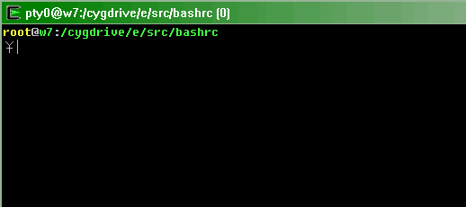

.bashrc with nice prompt and handy alias.



# Features
* nice prompt
* show tty and count commands in title
* colorized `ls`, many handy alias to `ls`
* aliases to enhance many commands, see `tz.bashrc` for details.
* outputs of `git diff`, `diff`, `man` and `gcc` are colorized.

# Installation

Works best with these packages installed
```bash
apt-get install colordiff less most cdargs psmisc bash-completion
pip install diff-highlight
```

Copy `tz.bashrc` to home directory, then add the following code to ~/.bashrc
```bash
if [ -r ~/tz.bashrc ]; then
	. ~/tz.bashrc
fi
```
